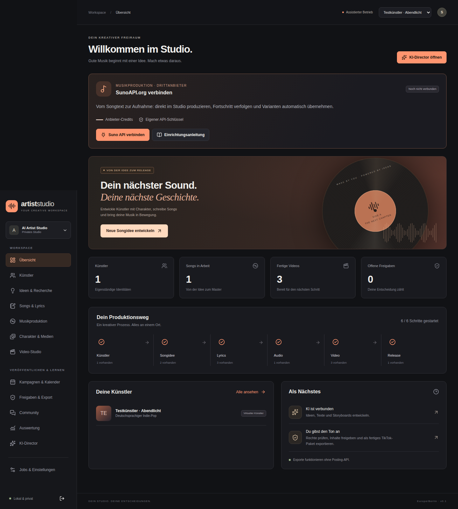
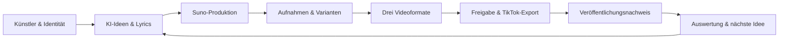

<div align="center">

# AI Artist Studio

### Dein Künstler. Dein Sound. Dein Studio.

Ein selbst gehostetes Produktionsstudio für virtuelle Musikkünstler — von der ersten Songidee bis zum fertigen TikTok-Paket.

**Deutsch · Ohne lokale GPU · ChatGPT- und Google-Login · Private Medien**

[Studio öffnen](https://artist.dorfspy.de) · [Installation](docs/OPERATIONS.md) · [Suno verbinden](docs/SUNO_API_SETUP.md) · [KI-Konten verbinden](docs/CLI_LOGIN.md)

</div>



## Ein durchgängiger Produktionsweg



| Bereich | Was du damit machen kannst |
|---|---|
| **Künstler** | Mehrere virtuelle Künstler führen, Character Bible versionieren, visuelle und musikalische Referenzen freigeben. |
| **Songwriting** | Echte KI-Ideen und Lyrics erstellen, Passagen gezielt überarbeiten, menschliche Zeilen schützen und Versionen vergleichen. |
| **Suno** | SunoAPI.org im Dashboard verbinden, Guthaben prüfen, Produktion freigeben und fertige Aufnahmen automatisch importieren. Alternativ vollständiges Produktionspaket und manueller Import. |
| **Medien** | Private Dateien, Herkunft/Rechte, Originale und Ableitungen, Audioplayer, Wellenform, technische Analyse und Variantenvergleich. |
| **Video-Studio** | Charakter & Lyrics, visueller Szenenclip und Cover-Visualizer: echte MP4 in 1080 × 1920 mit H.264/AAC. Timeline, Untertitel, Crop und Renderqueue. |
| **Veröffentlichung** | Kampagnen und Kalender, unveränderliche Freigaben, MP4/Cover/Caption/Checkliste als ZIP, manuelle Veröffentlichungsnachweise. |
| **Lernschleife** | Kommentare importieren, Antwortentwürfe schreiben, tatsächliche Kennzahlen auswerten und begründete nächste Produktionen planen. |

## Konten verbinden, direkt im Dashboard

### Text-KI ohne API-Key

Unter **Einstellungen → Provider & Konten**:

- **ChatGPT verbinden** startet die offizielle Codex-Geräteanmeldung mit Link und Code.
- **Google verbinden** startet die offizielle Gemini-Anmeldung. Google-Bestätigungscode im Dialog eingeben.
- **Verbindung live testen** prüft das angemeldete Konto durch einen echten kurzen Textauftrag.

Die Konten werden auf dem Computer des separaten Runners verbunden. Tokens bleiben dort; vorhandene globale CLI-Einstellungen werden nicht überschrieben. [Anleitung und Voraussetzungen →](docs/CLI_LOGIN.md)

### Automatische Musikproduktion

Auf der Übersicht **Suno API verbinden** wählen, eigenen Schlüssel eintragen und das Guthaben prüfen. Die **Einrichtungsanleitung** ist jederzeit als Modal verfügbar. Für Generierungen werden Modell, bestätigter Creditbedarf, Tages-/Monatslimit und HTTPS-Rückmelde-Adresse hinterlegt.

**SunoAPI.org ist ein separater Drittanbieter**, mit eigenem API-Konto und Credits. Das Studio speichert den Schlüssel verschlüsselt, verlangt eine Produktionsfreigabe und sendet bei unklarem externem Zustand keinen zweiten Generierungsauftrag. [Einrichtung und Fehlerbehandlung →](docs/SUNO_API_SETUP.md)

## Starten

### Eingerichteter Server

**https://artist.dorfspy.de** — HTTPS und drei systemd-Dienste sind eingerichtet. Für das erste Betreiberkonto wird ein einmaliger, separat übergebener Einrichtungscode benötigt. Es gibt kein voreingestelltes Login-Passwort. Danach eigene KI-Konten und bei Bedarf SunoAPI.org verbinden.

### Lokal auf Ubuntu

Voraussetzungen: **Node ≥22.12**, PostgreSQL-16-Werkzeuge, FFmpeg/ffprobe, Python 3, C-Compiler und Linux mit Landlock ABI ≥4. PostgreSQL/Redis werden im eigenen Projektverzeichnis betrieben; keine GPU nötig.

```bash
git clone https://github.com/meinzeug/ai-artist-studio.git
cd ai-artist-studio
npm run setup:local
npm run services:start
npm run db:migrate
npm run build
npm run studio:start
```

Öffnen: **http://127.0.0.1:3210**. Eigenes Betreiberkonto anlegen. Stoppen mit `npm run studio:stop`; Diagnose mit `npm run diagnose`.

Docker Compose ist ebenfalls enthalten. Dieser Weg wurde bislang **nicht ausgeführt**. [Betrieb, Compose, Backups und Updates →](docs/OPERATIONS.md)

## Architektur

```text
Next.js / React ── validierte Backend-Aktionen ── PostgreSQL + privater Storage
                                                  │
                                     dauerhafte Jobs / Outbox
                                                  │
                                           Redis / BullMQ
                                                  │
                                                Worker
                                      ┌───────────┼────────────┐
                                   FFmpeg     SunoAPI.org   CLI-Runner
                                                           Codex / Gemini
```

TypeScript, Next.js **16.3.5**, React **19.3.0**, PostgreSQL **16**, Drizzle **0.45.2**, BullMQ **6.3.8**. Abhängigkeiten sind exakt in [`package.json`](package.json) und [`package-lock.json`](package-lock.json) gepinnt. Lange Produktionen laufen im Worker. Der Runner hat keine Datenbank-, Musik- oder Social-Tokens. [Architektur →](docs/ARCHITECTURE.md)

## Geprüft – mit klaren Grenzen

- **38 Unit-/Integrationstests** bestanden; Typprüfung und Produktionsbuild erfolgreich.
- Vollständiger Playwright-Durchlauf mit **echter Codex-Textproduktion** und **drei tatsächlich gerenderten, decodierten und im Browser abgespielten Videos**.
- Suno-Dashboard, Budgetfreigabe, verschlüsselte Verbindung und Auftrag getestet. Anbieterantworten dabei ausdrücklich simuliert; echte lokale Audioimporte separat geprüft.
- Beide tatsächlichen CLI-Anmeldedialoge im Browser bis zum offiziellen Loginlink geprüft, einschließlich Abbruch und CSRF-Schutz. Kein persönlicher Login stellvertretend durchgeführt.
- Desktop-/Smartphone-Screenshots, Worker-Wiederaufnahme und echter Backup/Restore dokumentiert.
- Server: DNS, gültiges HTTPS, Healthcheck, Loginpflicht und Schutz der Ersteinrichtung geprüft.

```bash
npm run typecheck
npm test
npm run test:e2e
npm run diagnose
```

Tests verwenden eine separate Datenbank. Der CLI-E2E-Test benötigt eine eingerichtete Codex-Anmeldung und nutzt deren Kontingent. Medien und Messwerte der Screenshots sind gekennzeichnete Testdaten. [Vollständiger Testbericht →](docs/TEST_REPORT.md)

### Externe Freischaltungen

| Integration | Stand |
|---|---|
| Codex | Lokal mit ChatGPT live geprüft. Auf dem Server eigenes Konto im Dashboard verbinden. |
| Gemini | Offizieller Google-Login und Headless-Adapter implementiert. Modelltest nach persönlicher Anmeldung erforderlich. |
| SunoAPI.org | Implementiert und lokal mit simuliertem Anbieter getestet. Eigener Schlüssel und bestätigtes Creditbudget fehlen noch; keine bezahlte Liveproduktion. |
| Suno Platform | Separates Produkt; kein verifizierter Zugang. |
| TikTok OAuth / Display | Implementiert; Developer-App, Scopes und Live-Verbindung fehlen. |
| TikTok Direct Post | Keine Zulassung für ein privates internes Werkzeug versprochen. Freigegebener Export ist der produktive Veröffentlichungsweg. |
| Bild-/Videogeneratoren | Kein externer Anbieter konfiguriert. Upload, KI-Storyboards und lokale Videoerstellung funktionieren. |

## Dokumentation

[Produkt & Anforderungsmatrix](docs/PRODUCT_SPEC.md) · [Implementierungsplan](docs/IMPLEMENTATION_PLAN.md) · [Integrationsmatrix mit Quellen](docs/INTEGRATION_MATRIX.md) · [Sicherheit](docs/SECURITY.md) · [Betrieb](docs/OPERATIONS.md) · [Deployment](scripts/deploy/README.md) · [Testbericht](docs/TEST_REPORT.md) · [Übergabe](docs/HANDOVER.md)

<sub>Arbeitstitel in den Studio-Einstellungen änderbar. Keine Werbewasserzeichen. Keine heimlichen API-Fallbacks. Öffentliche Aktionen bleiben kontrolliert.</sub>
